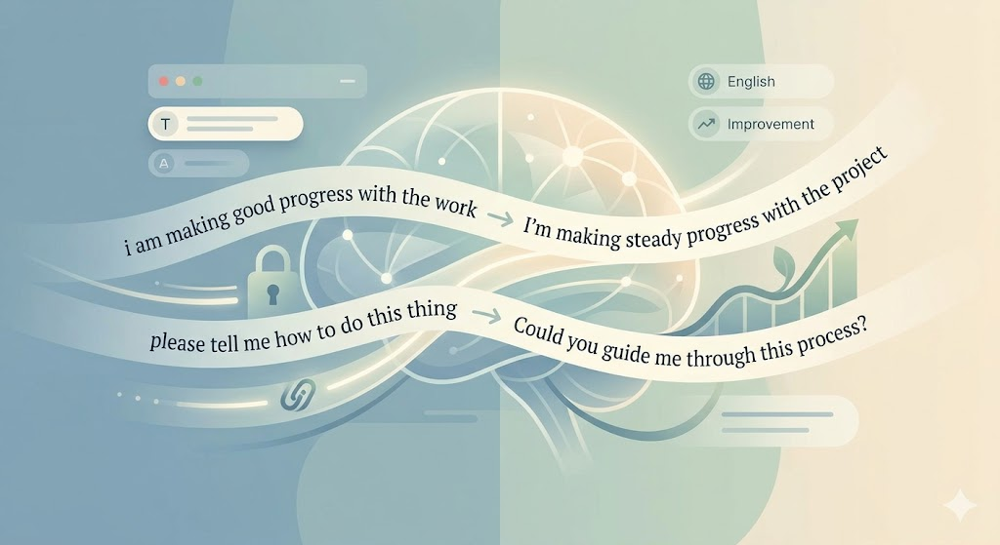

<div align="center">

# TypeLearn


### Learn English from every keystroke — in a calm, glassy inbox.

TypeLearn is a privacy-first macOS companion with a local service and a web UI. It turns daily typing into a quiet timeline of learning artifacts you can swipe through by day.

[](#)
[](#)
[](#)
[](#)
[](#)

<br/>

**TypeLearn quietly observes what you type, identifies learning moments, and surfaces them in a swipeable day ribbon — without interrupting your flow.**

<br/>

[Getting Started](#getting-started) · [Architecture](#architecture) · [API Reference](#api-reference) · [Privacy](#privacy) · [中文文档](README-zh.md)

</div>

<br/>

## The idea

Most language-learning tools ask for separate study time. TypeLearn meets you at the keyboard and turns real work into continuous practice.

> **Type naturally. Learn continuously. Stay in flow.**

<br/>

## What TypeLearn ships today

| Feature | Description |
|---|---|
| Day ribbon inbox | Horizontal day ribbon keeps focus tight while letting you swipe through time |
| Learning artifacts | Corrections, rewrites, and explanations built from your real text |
| Choices flow | Disambiguation for ambiguous pinyin or mixed inputs |
| Daily lesson | Pattern grouping and a daily summary view |
| Daily story | A narrative generated from your day’s writing |
| Local-first service | Node.js service with local persistence and retry queue |
| BYOK provider | Optional OpenAI-compatible provider settings |

<br/>

## Experience overview

1. Text is submitted to the local service (`POST /artifacts`).
2. The service assembles fragments, restores pinyin if needed, and generates learning artifacts.
3. The web UI renders a glassy inbox with a swipeable day ribbon and filters (All / English / Chinese).
4. Choices and daily lessons are surfaced as needed.

<br/>

## Repository layout

```
TypeLearn/
├─ macos/                  # SwiftUI shell (menu bar view stub)
│  └─ ContentView.swift
├─ service/                # Local orchestration service (Node.js + TS)
│  └─ src/
│     ├─ index.ts
│     ├─ store.ts
│     ├─ coaching.ts
│     ├─ translator.ts
│     ├─ story.ts
│     └─ persistence.ts
├─ web/                    # React + Vite UI (inbox, choices, stories)
├─ shared/                 # Shared TypeScript types
├─ scripts/                # Dev helpers
└─ PRODUCT.md              # Product vision
```

<br/>

## Getting Started

### Prerequisites

| Requirement | Version |
|-------------|---------|
| macOS | 12+ |
| Node.js | 18+ |

### Quick start (local service + web UI)

```bash
# Install
npm install

# Run service + web
npm run dev
```

- The service listens on `http://127.0.0.1:43010` by default.
- The web UI runs via Vite (see the terminal output for the URL).

### Workspace-specific commands

```bash
npm run dev:service     # Start service only
npm run dev:web         # Start web UI only
npm run build           # Build all workspaces
npm run typecheck       # Type-check everything
```

<br/>

## macOS app status

The macOS menu bar app is currently a SwiftUI shell located at `macos/ContentView.swift`. The Xcode project scaffolding is not committed yet. The `npm run dev:app` script currently prints a placeholder message.

When capture is enabled in the native app, macOS will require Accessibility and Input Monitoring permissions.

<br/>

## Architecture

```
                         TypeLearn
    ┌────────────────────────┼────────────────────────┐
    │                        │                        │
    ▼                        ▼                        ▼
┌────────┐              ┌─────────┐              ┌────────┐
│ macOS  │   (planned)  │ Service │  ◄─ types ─► │ Shared │
└────────┘              └─────────┘              └────────┘
   SwiftUI               Node.js                TypeScript
                         :43010
                              ▲
                              │
                           ┌──────┐
                           │ Web  │
                           └──────┘
                        React + Vite
```

### Data flow (current)

```
You type → POST /artifacts → fragment assembly → learning artifact
                                         │
                                         ├─ Choices (pinyin disambiguation)
                                         ├─ Daily lesson (patterns)
                                         └─ Story generation
```

<br/>

## Persistence & configuration

- Local state file: `~/.typelearn/state.json`
- Override with `TYPELEARN_STATE_FILE`
- Service host/port: `HOST` and `PORT` environment variables

Provider settings are stored locally and can be updated via `PUT /settings`:

```json
{
  "baseUrl": "http://localhost:11434",
  "apiKey": "sk-...",
  "model": "gpt-4.1-mini"
}
```

<br/>

## API Reference

The orchestration service runs at `http://127.0.0.1:43010`.

| Method | Endpoint | Description |
|:------:|----------|-------------|
| `GET` | `/health` | Health check & provider status |
| `GET` | `/artifacts` | List learning artifacts |
| `POST` | `/artifacts` | Submit text for artifact generation |
| `POST` | `/artifacts/:id/retry` | Retry a failed artifact |
| `GET` | `/records` | List captured text records |
| `DELETE` | `/records/:id` | Delete a capture record |
| `GET` | `/choices` | List choice items |
| `POST` | `/choices/:id/select` | Select a choice candidate |
| `DELETE` | `/choices/:id` | Drop a choice item |
| `GET` | `/patterns?day=YYYY-MM-DD` | Pattern counts for a day |
| `GET` | `/daily` | Daily lesson summary |
| `GET` | `/stories` | List generated stories |
| `POST` | `/stories/generate` | Generate a daily story |
| `GET` | `/settings` | Retrieve provider settings |
| `PUT` | `/settings` | Update provider settings |

<br/>

## Privacy

TypeLearn is built on a strict privacy model — your keystrokes are yours.

```
┌─────────────────────────────────────────────────────────┐
│                    Your Mac (local)                     │
│                                                         │
│   Typing ──► Capture ──► Process ──► ~/.typelearn/      │
│                                                         │
│   No telemetry     No cloud sync     No tracking         │
└─────────────────────────────────────────────────────────┘
                         │
                Only if YOU configure it
                         │
                         ▼
                ┌─────────────────┐
                │  Your API Key   │
                │  Your Provider  │
                └─────────────────┘
```

- All data persists locally by default.
- AI features are opt-in and require explicit provider configuration.
- No data is sent to TypeLearn developers.

<br/>

## Tech Stack

| Layer | Technology | Role |
|-------|-----------|------|
| Web UI | React 19, Vite | Inbox, choices, stories, settings |
| Service | TypeScript, Node.js | Orchestration, NLP, persistence |
| macOS | Swift 6, SwiftUI | Menu bar shell (stub) |
| Shared | TypeScript | Shared domain types |
| Persistence | JSON (local file) | `~/.typelearn/state.json` |
| IPC | HTTP (localhost) | App ↔ Service communication |

<br/>

## License

All rights reserved.

<div align="center">
<sub>Built with care for privacy and the craft of language.</sub>
</div>
